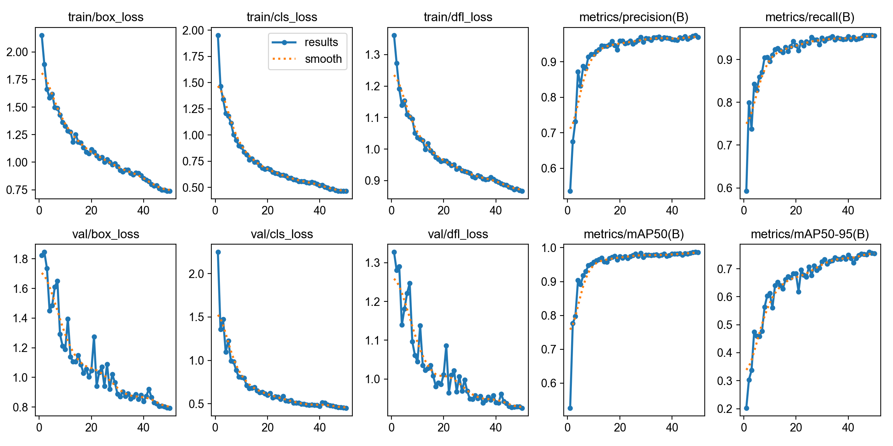
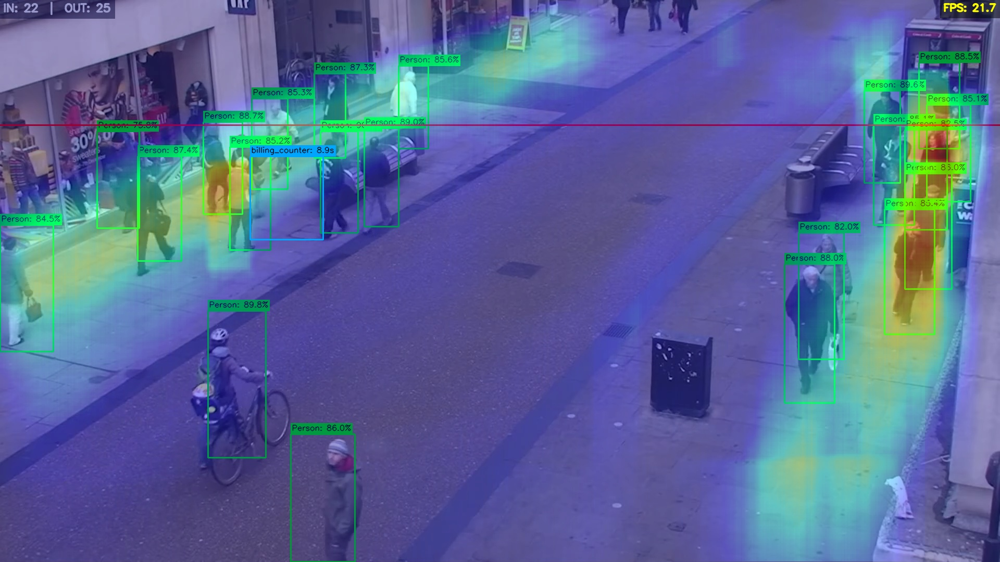
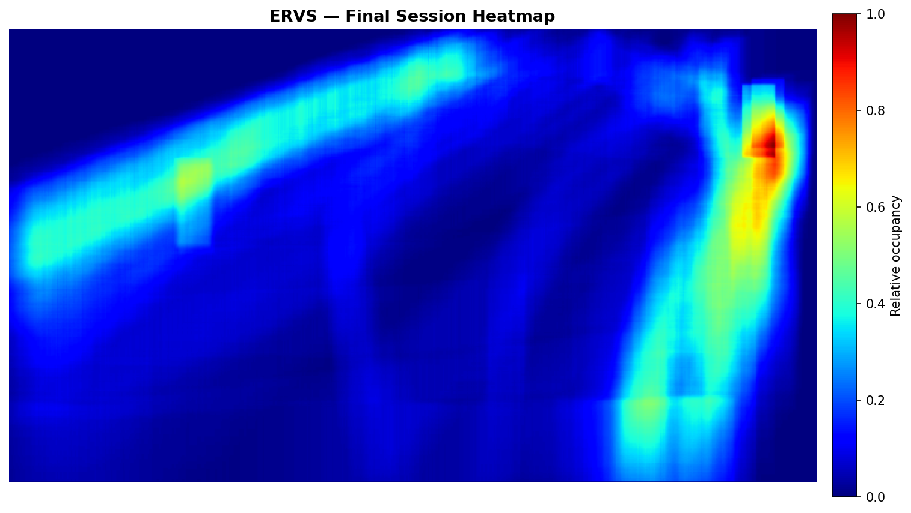

# Edge-Retail Vision Suite (ERVS)

## 1. Problem Statement
Physical retail environments require intelligent analytics to optimize store layouts, manage checkout queues, and understand customer flow. Historically, acquiring this data required expensive, proprietary sensor networks or heavy reliance on cloud infrastructure. Transmitting continuous, high-resolution video feeds to remote servers introduces significant challenges, including severe network latency, high bandwidth costs, and stringent data privacy vulnerabilities. There is a critical need for a privacy-preserving, cost-effective retail analytics suite capable of operating entirely on local hardware without sacrificing precision.

## 2. Role of Edge Computing
The ERVS pipeline is designed to execute completely offline on edge hardware, specifically targeting the NVIDIA Jetson Nano. 

* **Components on Jetson Nano:** Video decoding, frame preprocessing, YOLOv8n ONNX inference, Euclidean centroid tracking, and spatial analytics (heatmapping/dwell tracking) all run natively on the device.
* **Justification & Benefits:** Processing at the edge eliminates the need for constant cloud connectivity, allowing the system to function offline. This reduces bandwidth costs to near zero, cuts out cloud-server latency for real-time responsiveness, and guarantees consumer privacy by ensuring raw video frames are processed and destroyed in local memory rather than transmitted externally.

## 3. Methodology / Approach
The system operates on a continuous, highly optimized linear pipeline:

1. **Input:** Captures raw frames from an MP4 file or live camera feed. A frame-skip logic is implemented to maintain UI smoothness without overloading the hardware.
2. **Preprocessing:** Resizes and pads the raw frame to a normalized `640x640` float32 tensor while preserving the aspect ratio.
3. **Model Inference:** The ONNX Runtime engine executes the YOLOv8n model, outputting a dense matrix of bounding boxes and confidence scores.
4. **Coordinate Restoration:** Bounding boxes are mathematically mapped from the `640x640` tensor space back to the original video dimensions.
5. **Output Analytics:** * **Tracking:** A custom Euclidean distance centroid tracker assigns IDs.
   * **Tripwire:** Monitors Y-coordinate line crossings for Entry/Exit counts.   
   * **Dwell Zones:** Calculates time spent in predefined pixel coordinates.   
   * **Heatmap:** Uses vectorized NumPy slicing to accumulate spatial presence.

## 4. Model Details
* **Architecture:** YOLOv8n (You Only Look Once, version 8, nano variant).
* **Input Size & Format:** `[1, 3, 640, 640]` (Batch of 1, 3 RGB channels, 640x640 resolution).
* **Framework:** Originally trained in PyTorch (`ultralytics`), exported to **ONNX (Open Neural Network Exchange)** for deployment.
* **Optimization:** The ONNX conversion allows the model to dynamically utilize the `CUDAExecutionProvider` for GPU acceleration or fallback to the `CPUExecutionProvider`, bypassing the heavy overhead of the PyTorch framework during live deployment.

## 5. Training Details
* **Dataset:** Oxford Town Centre (High-density pedestrian surveillance dataset).
* **Training Procedure:** Custom single-class ("person") targeted training focusing on minimizing bounding box regression and objectness classification loss. 
* **Hyperparameters:** 50 Epochs, Batch Size of 8, Image Size of 640px.

### Performance Graphs
*(Loss vs. Epoch & Accuracy vs. Epoch)* 

## 6. Results / Output
The system outputs a live, annotated video feed displaying bounding boxes, confidence scores, an interactive Entry/Exit counter, dynamic dwell-time labels for predefined zones, and a toggleable false-color heatmap overlay.

### Sample Results
**Live Analytics View:** 

**Cumulative Spatial Heatmap:** 

### Performance Metrics & Hardware Comparison
A benchmarking suite evaluated YOLOv8n against YOLOv5n and SSD-MobileNet. YOLOv8n was selected for achieving an optimal balance of speed and a near-perfect **98.6% mAP**.

| Hardware Setup | Inference Time (ms) | Average FPS | Status |
| :--- | :--- | :--- | :--- |
| **Intel i5 / GTX 1650 Ti (Laptop)** | ~51.6 ms | ~19.4 FPS | Benchmark Verified |
| **NVIDIA Jetson Nano 4GB (Edge)** | ~80.0 ms | ~10 - 15 FPS | Projected Target |

## 7. Setup Instructions

### Prerequisites
* Python 3.10+
* Ensure NVIDIA Drivers, CUDA, and cuDNN are installed if utilizing GPU execution.

### Installation
1. Clone the repository to your local machine or Jetson Nano.
2. Navigate to the project directory and create a virtual environment:
   ```bash
   python -m venv venv
   source venv/bin/activate  # On Windows use: venv\Scripts\activate
   ```
3. Install the required dependencies:
   ```bash
   pip install -r requirements.txt
   ```

### Execution
To launch the Edge-Retail Vision Suite, simply run:
```bash
python main.py
```

**Keyboard Controls:**
* `q` : Quit the application
* `h` : Toggle the heatmap overlay ON/OFF
* `s` : Save a screenshot to the `runs/` directory